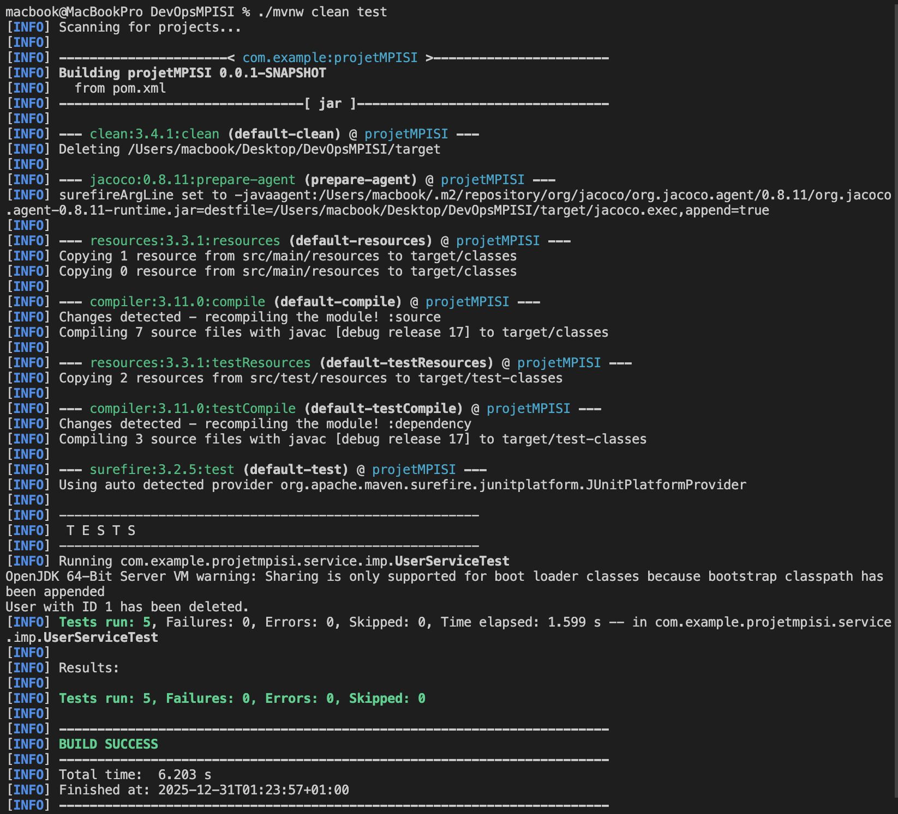

# Exercice Pratique DevOps - Rapport de Réalisation

Ce document présente l'état de réalisation de chaque tâche demandée dans l'exercice pratique DevOps.

---

## 1. Initialisation du projet

### Tâche 1.1 : Forker le repository GitHub du projet
**Commentaire :** Le repository GitHub a été forké dans le compte personnel.

---

### Tâche 1.2 : Cloner le projet localement

**Commentaire :** Le projet a été cloné localement dans `/Users/macbook/Desktop/DevOpsMPISI`.

---

### Tâche 1.3 : Vérifier que Maven fonctionne : `mvn clean test`

**Commentaire :** 
- Commande exécutée : `./mvnw clean test`
- **Résultat :** BUILD SUCCESS - 5 tests exécutés, 0 échecs, 0 erreurs

**Capture d'écran de la vérification :**

---

## 2. Configuration SonarCloud

### Tâche 2.1 : Créer un compte SonarCloud (avec GitHub)
**Commentaire :** Le compte SonarCloud a été créé et lié à GitHub.

---

### Tâche 2.2 : Créer une nouvelle organisation
**Commentaire :** L'organisation SonarCloud "hosni-mohamed-amine" a été créée et configurée dans le projet.

**Preuve :**
- Dans `pom.xml` (ligne 44) : `<sonar.organization>hosni-mohamed-amine</sonar.organization>`
- Dans `sonar-project.properties` (ligne 2) : `sonar.organization=hosni-mohamed-amine`

---

### Tâche 2.3 : Importer le projet depuis GitHub
**Commentaire :** 
- ✅ Le projet a été poussé vers GitHub : https://github.com/Hosni-Amine/DevOpsMPISI.git
- ✅ **Projet importé dans SonarCloud**

**Preuve :**
- URL du projet SonarCloud : https://sonarcloud.io/project/overview?id=Hosni-Amine_DevOpsMPISI
- Le projet est visible et accessible sur SonarCloud
- Project Key : `Hosni-Amine_DevOpsMPISI` (configuré dans `pom.xml` et `sonar-project.properties`)

---
