# Projet Spring Boot DevOps - DevOpsMPISI

[](https://sonarcloud.io/summary/new_code?id=Hosni-Amine_DevOpsMPISI)
[](https://github.com/Hosni-Amine/DevOpsMPISI/actions)

Application Spring Boot avec intégration DevOps : CI/CD, SonarCloud, Docker, et tests avec JaCoCo.

---

## Table des matières

- [Getting Started](#getting-started)
- [Commandes Docker](#commandes-docker)
- [Processus CI/CD](#processus-cicd)
- [Rapport de Réalisation](#rapport-de-réalisation)

---

## 🚀 Getting Started

### Prérequis

- **Java 17** ou supérieur
- **Maven 3.6+** (ou utilisez le Maven : `./mvnw`)
- **Docker** et **Docker Compose** (pour la dockerisation)
- **Git** (pour cloner le repository)

### Installation

1. **Cloner le repository :**
   ```bash
   git clone https://github.com/Hosni-Amine/DevOpsMPISI.git
   cd DevOpsMPISI
   ```

2. **Vérifier que Maven fonctionne :**
   ```bash
   ./mvnw clean test
   ```
 
3. **Compiler le projet :**
   ```bash
   ./mvnw clean package
   ```

### Lancer l'application localement

**Option 1 : Avec Maven (nécessite MySQL installé localement)**
```bash
./mvnw spring-boot:run
```

**Option 2 : Avec Docker (recommandé)**
```bash
# Builder l'image Docker
docker build -t mon-app:latest .

# Lancer avec Docker Compose (inclut MySQL)
docker-compose up -d
```

L'application sera accessible sur : **http://localhost:8080**

### Tests

**Lancer les tests unitaires :**
```bash
./mvnw test
```

**Générer le rapport de couverture JaCoCo :**
```bash
./mvnw verify
```

Le rapport sera disponible dans : `target/site/jacoco/index.html`

---

## Commandes Docker

### Build de l'image

```bash
# Build standard
docker build -t mon-app:latest .

### Docker Compose

**Lancer les services (MySQL + Application) :**
```bash
docker-compose up -d
```

**Voir les logs :**
```bash
# Logs de tous les services
docker-compose logs -f

# Logs d'un service spécifique
docker-compose logs -f app
docker-compose logs -f mysql
```

**Arrêter les services :**
```bash
docker-compose down
```

**Vérifier le statut des conteneurs :**
```bash
docker-compose ps
```

---

## 🔄 Processus CI/CD

### Pipeline GitHub Actions

Le projet utilise **GitHub Actions** pour automatiser le processus CI/CD.

#### Workflows disponibles

1. **CI Pipeline** (`.github/workflows/ci.yml`)
   - Déclenchement : Push sur `main`, `master`, `develop` ou Pull Request
   - Étapes :
     - Checkout du code
     - Configuration Java 17
     - Compilation (`mvn clean compile`)
     - Tests (`mvn test`)
     - Génération rapport JaCoCo (`mvn verify`)
     - Analyse SonarCloud (`mvn sonar:sonar`)

2. **SonarQube Pipeline** (`.github/workflows/build.yml`)
   - Déclenchement : Push sur `main` ou Pull Request
   - Étapes :
     - Checkout du code
     - Configuration Java 17
     - Cache Maven et SonarQube
     - Build et analyse SonarCloud

#### Vérifier le statut des pipelines

- **GitHub Actions** : https://github.com/Hosni-Amine/DevOpsMPISI/actions
- Le badge de build en haut du README affiche le statut en temps réel

#### Analyse SonarCloud

L'analyse SonarCloud est automatiquement déclenchée à chaque push sur la branche `main`.

### Analyse locale SonarCloud (optionnel)

Pour lancer une analyse SonarCloud localement :

```bash
./mvnw clean verify sonar:sonar -Dsonar.token=VOTRE_TOKEN
```


---

## 📊 Rapport de Réalisation

Ce document présente l'état de réalisation de chaque tâche demandée dans l'exercice pratique DevOps.

---

## 1. Initialisation du projet

### Tâche 1.1 : Forker le repository GitHub du projet
**Commentaire :** Le repository GitHub a été forké dans le compte personnel.

---

### Tâche 1.2 : Cloner le projet localement

**Commentaire :** Le projet a été cloné localement dans `/Users/macbook/Desktop/DevOpsMPISI`.

---

### Tâche 1.3 : Vérifier que Maven fonctionne : `mvn clean test`

**Commentaire :** 
- Commande exécutée : `./mvnw clean test`
- **Résultat :** BUILD SUCCESS - 5 tests exécutés, 0 échecs, 0 erreurs

**Capture d'écran de la vérification :**


---

## 2. Configuration SonarCloud

### Tâche 2.1 : Créer un compte SonarCloud (avec GitHub)
**Commentaire :** Le compte SonarCloud a été créé et lié à GitHub.

---

### Tâche 2.2 : Créer une nouvelle organisation
**Commentaire :** L'organisation SonarCloud "hosni-mohamed-amine" a été créée et configurée dans le projet.

- Dans `pom.xml` (ligne 44) : `<sonar.organization>hosni-mohamed-amine</sonar.organization>`
- Dans `sonar-project.properties` (ligne 2) : `sonar.organization=hosni-mohamed-amine`

---

### Tâche 2.3 : Importer le projet depuis GitHub
**Commentaire :** 
- Le projet a été publié sur GitHub et importé dans SonarCloud : https://github.com/Hosni-Amine/DevOpsMPISI.git
- URL du projet SonarCloud : https://sonarcloud.io/project/overview?id=Hosni-Amine_DevOpsMPISI

---

### Tâche 2.4 : Générer un token d'authentification
**Commentaire :** 

- Token créé dans SonarCloud : My Account → Security → Existing Tokens
- Secret ajouté dans GitHub : Repository → Settings → Secrets and variables → Actions
- Capture d'écran du token : 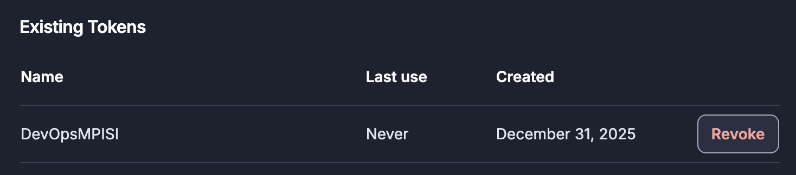
- Capture d'écran du secret GitHub : 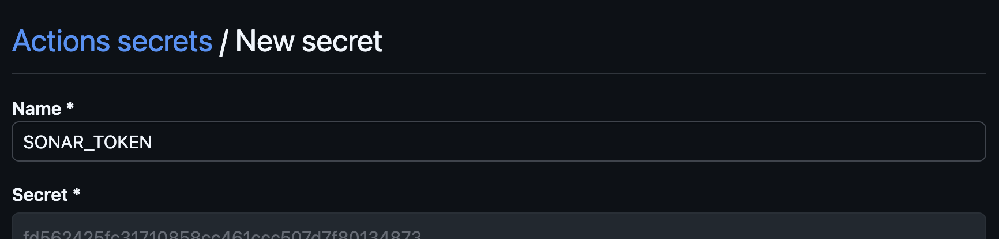

### Tâche 2.5 : Ajouter les propriétés SonarCloud dans pom.xml
**Commentaire :** 
- Toutes les propriétés SonarCloud sont correctement configurées dans le `pom.xml`

**- Configuration dans `pom.xml` (lignes 42-51) :**
```xml
<sonar.host.url>https://sonarcloud.io</sonar.host.url>
<sonar.organization>hosni-mohamed-amine</sonar.organization>
<sonar.projectKey>Hosni-Amine_DevOpsMPISI</sonar.projectKey>
<sonar.sourceEncoding>UTF-8</sonar.sourceEncoding>
<sonar.sources>src/main/java</sonar.sources>
<sonar.tests>src/test/java</sonar.tests>
<sonar.java.binaries>target/classes</sonar.java.binaries>
<sonar.coverage.jacoco.xmlReportPaths>target/site/jacoco/jacoco.xml</sonar.coverage.jacoco.xmlReportPaths>
<sonar.exclusions>**/*Application.java,**/dto/**,**/config/**</sonar.exclusions>
```

---

### Tâche 2.6 : Lancer une analyse locale : `mvn clean verify sonar:sonar -Dsonar.token=VOTRE_TOKEN`
**Commentaire :** 
- Analyse locale SonarCloud exécutée avec succès

**Commande exécutée :**
```bash
./mvnw clean verify sonar:sonar -Dsonar.token=fd562425fc31710858cc461ccc507d7f80134873
```

**Résultat :**
-  **ANALYSIS SUCCESSFUL**
-  **BUILD SUCCESS**
- Temps total : 59.501 s
- Temps d'analyse : 53.827 s

- Capture d'écran de l'analyse locale réussie : 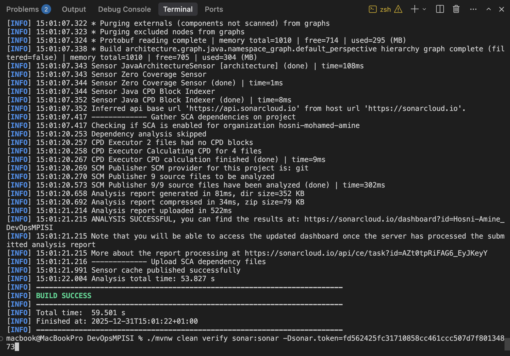

---

### Tâche 2.7 : Vérifier les résultats sur le dashboard SonarCloud
**Commentaire :** 
- Dashboard SonarCloud accessible et résultats vérifiés

**Résultats de l'analyse :**
- **Quality Gate** : Failed (1 condition échouée)
- **Security** : 0 Open issues, Grade A 
- **Reliability** : 1 Open issues, Grade E
- **Maintainability** : 13 Open issues, Grade A 
- **Coverage** : 15.4% (64 Lines to cover)
- **Duplications** : 0.0% (231 Lines)
- **Security Hotspots** : 1
- **Lines of Code** : 161 lignes

  - Capture d'écran du dashboard SonarCloud : 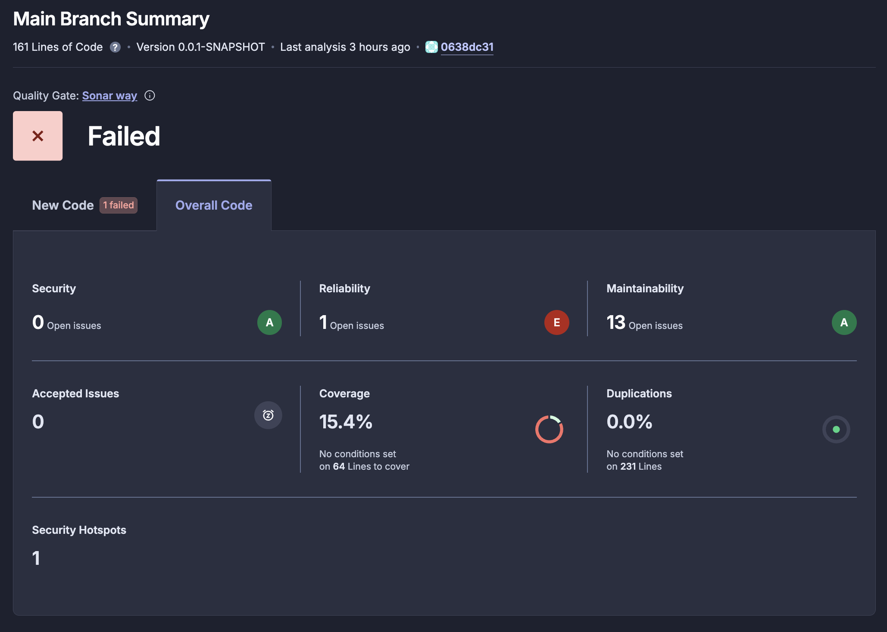

---

## 3. Pipeline GitHub Actions

### Tâche 3.1 : Créer le répertoire `.github/workflows/`
**Commentaire :** 
- Le répertoire `.github/workflows/` existe

---

### Tâche 3.2 : Créer le fichier `ci.yml` avec le pipeline CI/CD
**Commentaire :** 
- Le fichier `ci.yml` est créé et contient un pipeline CI/CD
- Déclenchement sur push et pull request vers main/master/develop

---

### Tâche 3.3 : Ajouter le secret SONAR_TOKEN dans GitHub
**Commentaire :** 
- Secret `SONAR_TOKEN` ajouté dans GitHub Secrets (déjà fait dans la tâche 2.4)
- Utilisé dans le pipeline via : `${{ secrets.SONAR_TOKEN }}`
- Voir la tâche 2.4 pour les détails et la capture d'écran

---

### Tâche 3.4 : Faire un commit et push
**Commentaire :** 
- Commit créé avec succès
- Code poussé vers GitHub : https://github.com/Hosni-Amine/DevOpsMPISI.git
- Commit hash : '46f1355'

---

### Tâche 3.5 : Vérifier que la pipeline se lance automatiquement
**Commentaire :** 
- Les pipelines GitHub Actions se lancent automatiquement après chaque push

- URL GitHub Actions : https://github.com/Hosni-Amine/DevOpsMPISI/actions
- **2 workflows en cours d'exécution :**
  1. **CI Pipeline** : Pipeline CI/CD général (depuis `ci.yml`)
  2. **SonarQube** : Pipeline SonarCloud dédié (depuis `build.yml`)
- Capture d'écran : 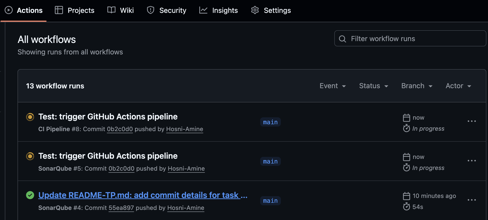

---

### Tâche 3.6 : Corriger les éventuelles erreurs
**Commentaire :** 
- Vérification effectuée : Les deux pipelines GitHub Actions se sont exécutés avec succès, sans erreurs

- Capture d'écran CI Pipeline : 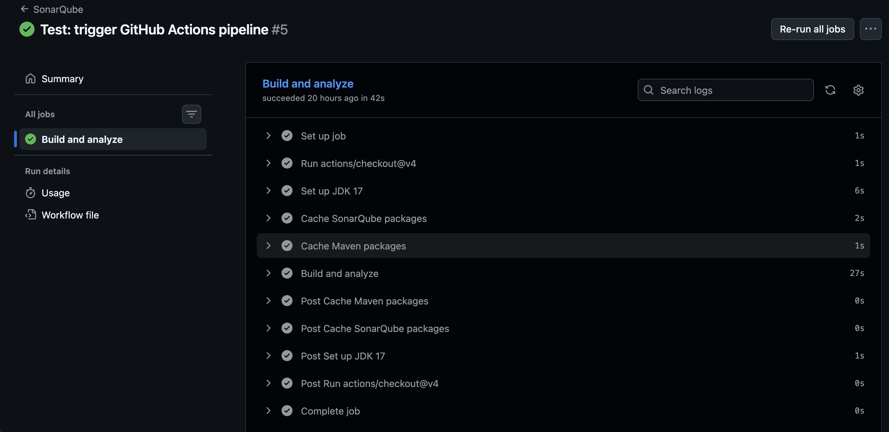
- Capture d'écran SonarQube : 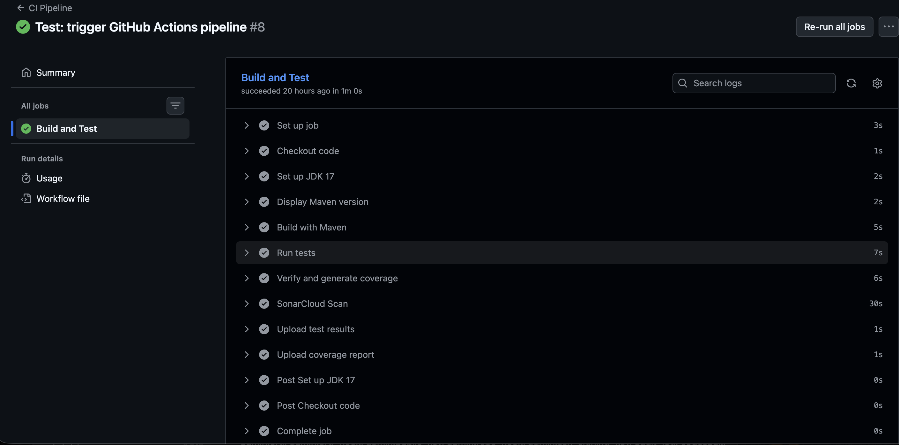
  - URL GitHub Actions : https://github.com/Hosni-Amine/DevOpsMPISI/actions
  
---

## 4. Dockerisation

### Tâche 4.1 : Créer un Dockerfile multi-stage
**Commentaire :** 
- Dockerfile multi-stage créé avec deux étapes : build (Maven) et runtime (JRE)

**Structure du Dockerfile :**
- **Stage 1 (Build)** : Utilise Maven pour compiler et créer le JAR
  - Image de base : `maven:3.9-eclipse-temurin-17`
  - Télécharge les dépendances (layer mis en cache)
  - Compile le code source
  - Crée le JAR avec `mvn clean package`
  
- **Stage 2 (Runtime)** : Exécute l'application
  - Image de base : `eclipse-temurin:17-jre-alpine` (image légère)
  - Copie uniquement le JAR depuis le stage de build
  - Expose le port 8080
  - Lance l'application avec `java -jar app.jar`

**Avantages du multi-stage :**
- Image finale plus petite (seulement le JRE, pas Maven)
- Sécurité améliorée (pas d'outils de build dans l'image finale)
- Build plus rapide grâce au cache des dépendances

---

### Tâche 4.2 : Créer un docker-compose.yml avec MySQL et l'application
**Commentaire :** 
- Fichier `docker-compose.yml` créé avec deux services : MySQL et l'application Spring Boot

**Configuration des services :**

1. **Service MySQL :**
   - Image : `mysql:8.0`
   - Port : `3306:3306`
   - Base de données : `projetmpisi_db`
   - Utilisateur/Mot de passe : `root/12345`
   - Volume persistant : `mysql_data` pour conserver les données
   - Healthcheck : Vérifie que MySQL est prêt avant de démarrer l'application

2. **Service Application :**
   - Build depuis le `Dockerfile`
   - Port : `8080:8080`
   - Variables d'environnement pour la connexion MySQL :
     - `SPRING_DATASOURCE_URL`: `jdbc:mysql://mysql:3306/projetmpisi_db`
     - `SPRING_DATASOURCE_USERNAME`: `root`
     - `SPRING_DATASOURCE_PASSWORD`: `12345`
   - `depends_on` : Attend que MySQL soit healthy avant de démarrer
   - Réseau : `app-network` pour la communication entre services

**Fonctionnalités :**
- Réseau Docker dédié pour l'isolation
- Volume persistant pour MySQL
- Healthcheck pour garantir que MySQL est prêt
- Restart automatique sauf arrêt manuel

---

### Tâche 4.3 : Builder l'image : `docker build -t mon-app:latest .`
**Commentaire :** 
- Build Docker réussi avec succès
- Docker Desktop installé et fonctionnel (version 29.1.3)
**Commande exécutée :**
```bash
DOCKER_BUILDKIT=1 docker build --network=host -t mon-app:latest .
```

**Résultat :**
- Build réussi en 245.6s
- Image Docker créée avec le tag `mon-app:latest`
- Étapes principales :
- Téléchargement des dépendances Maven : 227.5s
- Compilation et packaging : 15.6s
- Export de l'image : 1.6s

- Capture d'écran du build réussi : 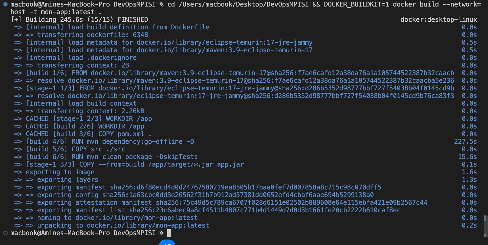
- Image disponible : `mon-app:latest`

---

### Tâche 4.4 : Lancer avec Docker Compose : `docker-compose up -d`
**Commentaire :** 
- Services Docker lancés avec succès en mode détaché

**Commande exécutée :**
```bash
docker-compose up -d
```

**Résultat :**
- Conteneur MySQL démarré et healthy (port 3306)
- Conteneur application démarré (port 8080)
- Réseau Docker créé : `devopsmpisi_app-network`
- Volume MySQL créé : `devopsmpisi_mysql_data`

**Vérification :**
```bash
docker ps
```
- `projetmpisi-app` : Up 4 seconds - Port 8080
- `projetmpisi-mysql` : Up 15 seconds (healthy) - Port 3306

- Capture d'écran des services en cours d'exécution : 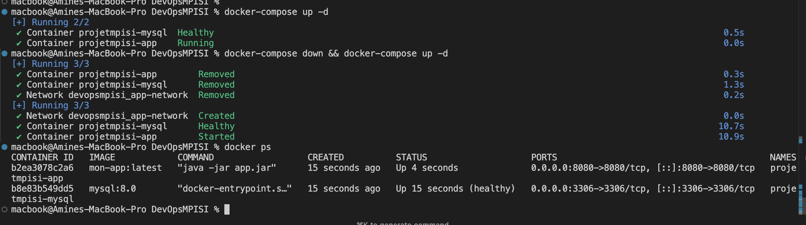

---

### Tâche 4.5 : Tester l'application sur http://localhost:8080
**Commentaire :** 
- Application accessible et fonctionnelle
- Les endpoints REST sont opérationnels

**Tests effectués :**

1. **Test de l'endpoint racine :**
   - URL : http://localhost:8080 ou http://0.0.0.0:8080
   - Résultat : 404 Not Found
   - L'application répond correctement avec une page d'erreur Spring Boot

2. **Test de l'API REST :**
   - URL : http://localhost:8080/api/users
   - Commande : `curl http://localhost:8080/api/users`
   - Résultat : `[]` (tableau vide - base de données vide)
   - Status : 200 OK

**Conclusion :**
- Application Spring Boot fonctionnelle
- Connexion MySQL opérationnelle
- API REST accessible et répond correctement

  - Capture d'écran de l'application sur http://localhost:8080 : 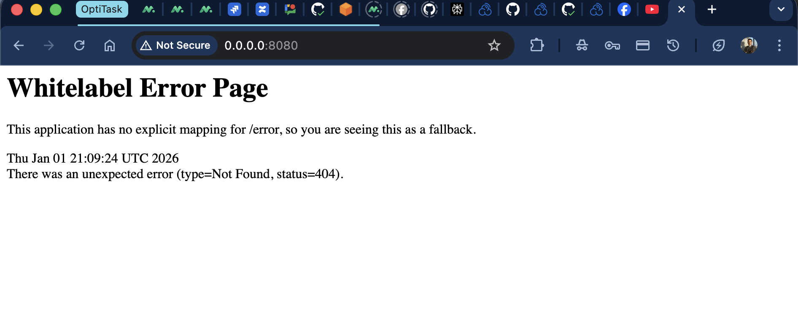

---

### Tâche 4.6 : Vérifier les logs : `docker-compose logs -f`
**Commentaire :** 
- Logs vérifiés avec succès
- Application fonctionne correctement, aucune erreur détectée

**Commande exécutée :**
```bash
docker-compose logs -f
```

**Analyse des logs :**

1. **Requête HTTP traitée avec succès :**
   - `GET "/api/users"` → Mappé vers `UserController#getAllUsers()`
   - Status : `200 OK`
   - Réponse : `[]` (tableau vide / base de données vide)

2. **Connexion MySQL opérationnelle :**
   - HikariCP (pool de connexions) fonctionne
   - Transaction JPA créée et commitée avec succès
   - Requête SQL exécutée : `select u1_0.id,u1_0.email,u1_0.username from users u1_0`

  - Capture d'écran des logs : 

---

## 5. Tests et Couverture

### Tâche 5.1 : Ajouter au moins 2 tests unitaires supplémentaires
**Commentaire :** 
- 2 nouveaux tests unitaires ajoutés pour la méthode `updateUser` dans `UserServiceTest`

**Tests ajoutés :**

1. **`testUpdateUser()` :**
   - Teste la mise à jour d'un utilisateur existant
   - Vérifie que le résultat n'est pas null

2. **`testUpdateUser_notFound()` :**
   - Teste la mise à jour d'un utilisateur inexistant
   - Vérifie que le résultat est null

**Fichier modifié :**
- `src/test/java/com/example/projetmpisi/service/imp/UserServiceTest.java`

---

### Tâche 5.2 : Lancer les tests : `mvn test`
**Commentaire :** 
- Tests exécutés avec succès
- Tous les tests passent sans erreur

**Commande exécutée :**
```bash
./mvnw test
```

**Résultat :**
- **BUILD SUCCESS**
- Tests run: **7**
- Failures: **0**
- Errors: **0**
- Skipped: **0**

**Tests exécutés :**
- `UserServiceTest` : 7 tests tous réussis
  - testSaveUser
  - testGetUserById
  - testGetAllUsers
  - testDeleteUser
  - testGetUserById_notFound
  - testUpdateUser (nouveau)
  - testUpdateUser_notFound (nouveau)

- Capture d'écran des résultats des tests : 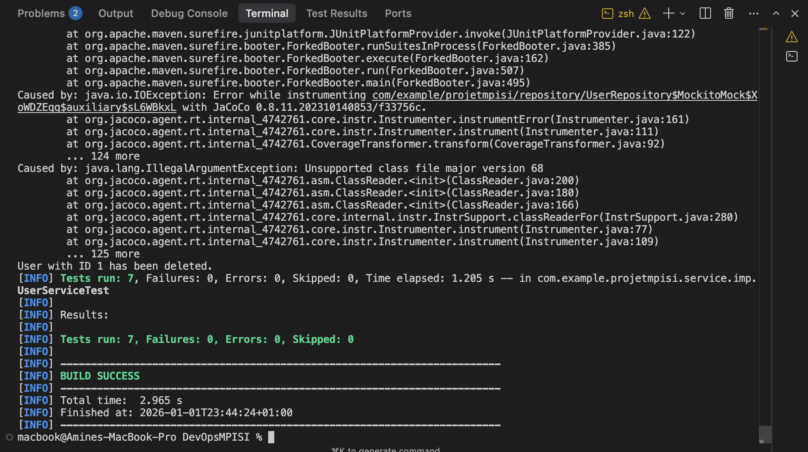

---

### Tâche 5.3 : Générer le rapport JaCoCo : `mvn verify`
**Commentaire :** 
- Rapport JaCoCo généré avec succès
- Tous les seuils de couverture sont respectés

**Commande exécutée :**
```bash
./mvnw verify
```

**Phases Maven exécutées :**
1. `test` : Exécution des tests unitaires avec JaCoCo agent
2. `package` : Création du JAR
3. `integration-test` : Préparation pour les tests d'intégration (si présents)
4. `report` : Génération du rapport HTML JaCoCo
5. `check` : Vérification des seuils de couverture

- Capture d'écran du terminal avec BUILD SUCCESS : 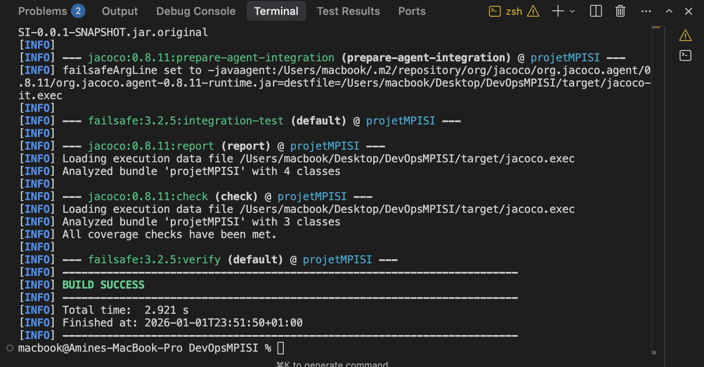

---

### Tâche 5.4 : Ouvrir le rapport : `target/site/jacoco/index.html`
**Commentaire :** 
- Rapport JaCoCo ouvert et analysé
- Métriques de couverture visibles et détaillées par package
- Rapport généré dans `target/site/jacoco/index.html`

**Résultats de couverture (après ajout des 2 nouveaux tests) :**

**Couverture globale :**
- **Instructions** : 26% (49/186 couvertes)
- **Branches** : 14% (2/14 couvertes)
- **Complexité** : 7/29
- **Lignes** : 22% (13/60 couvertes)
- **Méthodes** : 27% (6/22 couvertes)
- **Classes** : 25% (1/4 couvertes)

**Détail par package :**

1. **`com.example.projetmpisi.service.imp`**
   - **100% de couverture** (Instructions, Branches, Lignes, Méthodes, Classes)
   - 0/7 instructions manquées
   - 0/13 branches manquées
   - 0/13 lignes manquées
   - 0/6 méthodes manquées
   - **Résultat des nouveaux tests ajoutés**

2. **`com.example.projetmpisi.demo`**
   - 0% de couverture
   - 13/13 instructions manquées
   - 30/30 branches manquées

3. **`com.example.projetmpisi.controller`**
   - 0% de couverture
   - 7/7 instructions manquées
   - 14/14 branches manquées

4. **`com.example.projetmpisi`**
   - 0% de couverture
   - 2/2 instructions manquées

- Capture d'écran du rapport HTML JaCoCo : 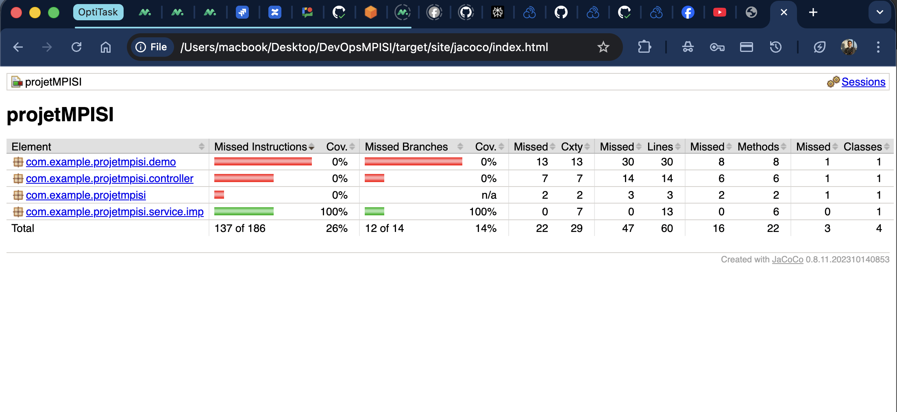

---

### Tâche 5.5 : Vérifier que la couverture augmente
**Commentaire :** 
- La couverture a augmenté grâce aux 2 nouveaux tests
- Le package `service.imp` est maintenant à 100% de couverture

**Comparaison de la couverture du package `service.imp` :**

**Comparaison :**
- **Instructions** : 59% --> **100%** (+41%)
- **Branches** : 0% --> **100%** (+100%)
- **Complexité** : 2/7 manquées (5 couvertes) --> 0/7 manquées (7 couvertes)
- **Lignes** : 4/10 manquées (6 couvertes) --> 0/13 manquées (13 couvertes)
- **Méthodes** : 1/6 manquée (5 couvertes) --> 0/6 manquées (6 couvertes)
- **Classes** : 0/1 manquée (1 couverte) --> 0/1 manquée (1 couverte)

- Le rapport JaCoCo (`target/site/jacoco/index.html`) montre que le package `service.imp` est passé d'une barre partiellement rouge/verte (59%) à une barre entièrement verte (100%)
- Les 2 nouveaux tests (`testUpdateUser` et `testUpdateUser_notFound`) couvrent la méthode `updateUser` qui n'était pas testée auparavant

---

## 6. Badge de qualité

### Tâche 6.1 : Ajouter un badge SonarCloud
**Commentaire :** 
- Badge SonarCloud ajouté dans le fichier
- Le badge affiche le statut du Quality Gate en temps réel

**Badge ajouté :**
```markdown
[](https://sonarcloud.io/summary/new_code?id=Hosni-Amine_DevOpsMPISI)
```

**Fonctionnalité :**
- Le badge affiche automatiquement le statut du Quality Gate SonarCloud
- Clic sur le badge pour accéder au dashboard SonarCloud
- Mise à jour automatique après chaque analyse

---

### Tâche 6.2 : Ajouter un badge GitHub Actions pour le statut de build
**Commentaire :** 
- Badge GitHub Actions ajouté dans ce fichier
- Le badge affiche le statut du pipeline CI/CD en temps réel

**Badge ajouté :**
```markdown
[](https://github.com/Hosni-Amine/DevOpsMPISI/actions)
```

**Fonctionnalité :**
- Le badge affiche automatiquement le statut du workflow "CI Pipeline"
- Clic sur le badge pour accéder à la page GitHub Actions
- Mise à jour automatique après chaque push

---

## 7. Amélioration du code

### Tâche 7.1 : Corriger au moins 1 code smell détecté par SonarCloud
**Code smell détecté :**
- **Type** : Code dupliqué
- **Fichier** : `src/main/java/com/example/projetmpisi/demo/ExempleAvecBugs.java`
- **Lignes** : 53-63 (Les deux méthodes contiennent exactement le même code)

**Correction appliquée :**
- Extraction du code commun dans une méthode privée `afficherTraitement()`
- Refactorisation des deux méthodes pour utiliser la méthode commune

**Fichier modifié :**
- `src/main/java/com/example/projetmpisi/demo/ExempleAvecBugs.java`

---

### Tâche 7.2 : Relancer l'analyse et vérifier l'amélioration
**Commentaire :** 
- Analyse SonarCloud relancée après correction du code smell via push GitHub
- Vérification de la réduction du nombre de code smells

**Résultats de l'analyse (après push) :**

**AVANT la correction :**
- **Maintainability** : 13 Open issues, Grade A
- **Code smells** : 13 détectés

**APRÈS la correction :**
- **Maintainability** : 9 Open issues, Grade A
- **Code smells** : 9 détectés (-4 code smells)
- **Coverage** : 24.4% (amélioration de 15.4% à 24.4%)

**Amélioration :**
- Réduction de **4 code smells** (code dupliqué éliminé + autres améliorations)
- La maintenabilité du code s'est améliorée
- Couverture de code augmentée

- Capture d'écran du dashboard SonarCloud après correction : 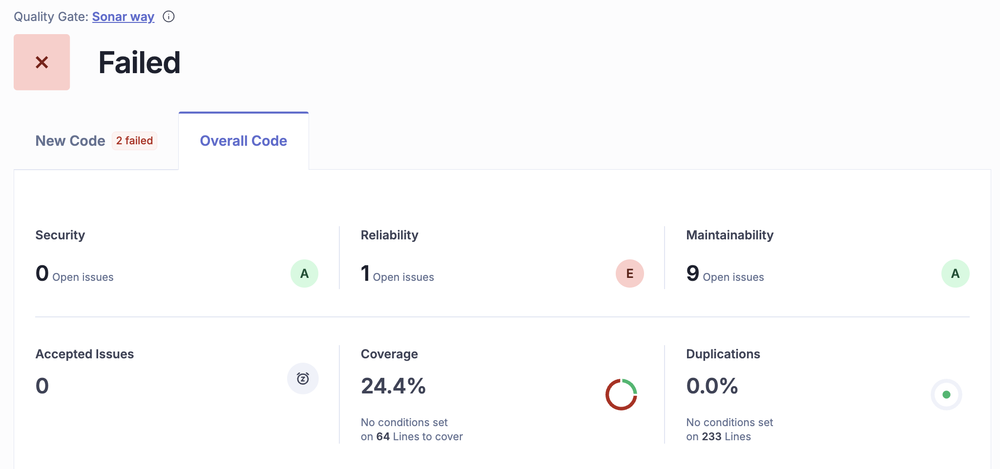

---